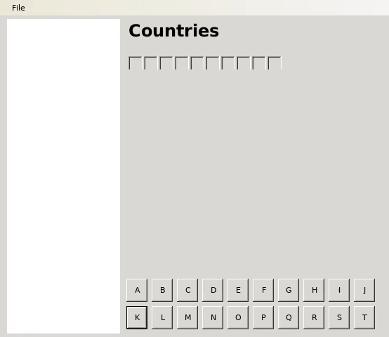

# hangman
a simple hangman game using winforms

## building and running on linux
1. install mono
2. run xbuild
3. run mono bin/Debug/hangman.exe

## building and running on window
Just use visual studio
